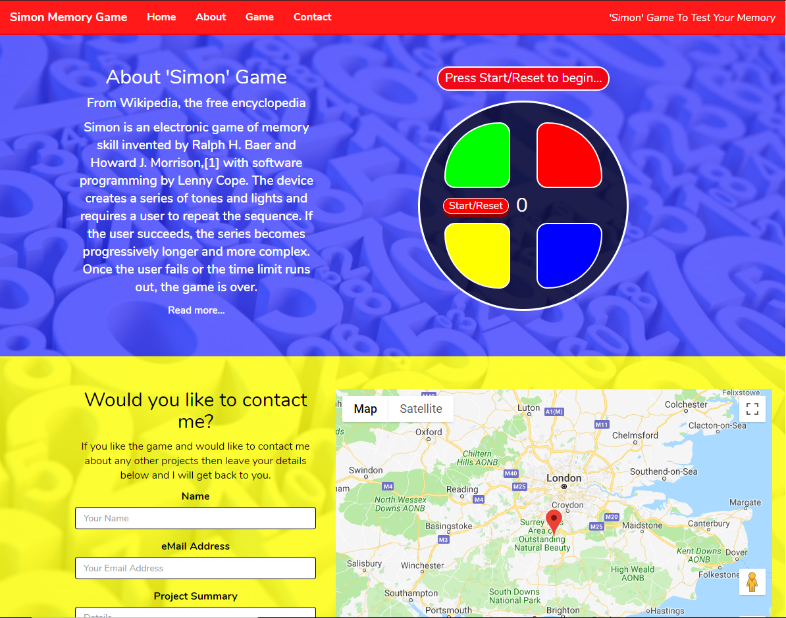

# Simon Game

## Reason For Project

This project has been built for the Interactive Frontend Development Milestone Project. 
The brief was to build a frontend-only website using the technologies that we have learned throughout Interactive Frontend Development. 

I have decided to create a simple single-player memory game inspired by Simon. 
You can click on [a You Tube video](https://www.youtube.com/watch?v=1Yqj76Q4jJ4) and [Wikipedia](https://en.wikipedia.org/wiki/Simon_(game)) to understand the rules of the game. 
The live website can be found [here](https://darrenmessenger.github.io/simon-game/).

## Features

### Wireframes

The wireframes for this website can be found in the repository within Github in the directory "assets/images/Wireframes".

### Existing Features

#### Main Page
On the main page there is a background image of some random numbers, which seemed to suit the Simon game. 
The two main sections have this background but I have put a put an opaque overlay over the background image, one in blue and the other in yellow. 
I chose this as it suited the colours of the actual Simon game (red, blue, green, yellow).

#### Header:
There is a static header at the top of the page which includes some menu items to take you to different parts of the page. 
I have incorporated some jquery code that I found on stackoverflow that allows the page to scroll smoothly when a navigation link is clicked. 

#### Navigation:
On the top of each page there is a navigation bar so that each page can be clicked. The navigation bar remains constant on each page and uses hover.css when hovering over each menu item so that the menu item is highlighted. 
On larger screens the navigation menu is on one row. On medium screens the navigation menu is on two rows with three items on each row. 
On small screens the navigation menu disappears and a bootstrap burger button appears so that the menu can be toggled on or off. 

#### The Landing Page:
A full screen background of the Monkees with a button to link you to the booking page so that you can book the Monkees for your next event. There is also a short history of the Monkees with a link via Wikipedia to learn more about them. 
If you can't remember how the Monkees sound there is a sample track to remind you. The link to the audio file changed from the local repository to google drive as it did not play when the website was published on github. 

#### The Band Members:
Each member has a description from Wikipedia along with a photo. There is also a 'Read more...' with a link to Wikipedia for each member. The page utilises the bootstrap grid layout. 

#### Audio Tracks:
There are some sample audio tracks from the Monkees on this page. The page utilises the bootstrap grid layout. 
The links to the audio files have changed from the local repository to google drive as they did not play when the website was published on github. 

#### Video:
There is a page with a video showing one of the Monkees tracks. The link to the ideo file changed from the local repository to google drive as it did not play when the website was published on github. 

#### Party Bookings:
A form to allow the user to enter details so that they may book the Monkees to appear at their own event. All the details are very clear using descriptive placeholders. 

### Features Left to Implement

#### Footer:
At the bottom of each page there are links to various social media including Facebook, Twitter and YouTube. The links also uses hover.css so they are highlighted when hovered over. These links do not do anything yet. 

#### Search:
This is displayed on the navigation bar but it doesn't do anything yet. 

## Technologies Used

Bootstrap, html and css have been used during the coding of this website. 

## Testing
Every page has been tested as described below.

### Header

The main title has been clicked to make sure it takes the user back to the landing page. 

### Navigation

On the top of each page there is a navigation bar with 6 menu items. Each menu item has been tested on each page to ensure it takes the user to the correct page. When each menu item is hovered over then that menu was tested to make sure the use of Hover.css rectangle out is working. 

When on a large screen the 6 menu items are across the top in one line. On a medium screen the menu items are on 2 rows of 3 items each. On a small screen the menu items disappear and a bootstrap burger button appears which, when clicked, displays the menu items on 2 rows of 3 items each. If clicked again the menu will disappear again.  

### Home

There is a short history of the Monkees with a link to Wikipedia which opens up a new page so that the user can read some more about the Monkees. The audio clip was checked to make sure it worked.  

When on medium to large screen the audio clip control and the image are on the same row. On a small screen they are on separate rows. 

### Band Members

Each band member has a link to Wikipedia which opens up a new page when the user clicks on the link. The page that opened was checked to make sure it was linking to the correct member. 

When on medium to large screen the band members description and image are on the same row. On a small screen they are on separate rows. 

### Audio Clips

There are three audio clips and each one was tested to make sure the correct song was played. There is also a download link for each song which was tested. 

When on medium to large screen the audio clip control and the image are on the same row. On a small screen they are on separate rows. 

### Video Clips

There is a video clip which was tested to make sure it played correctly. There is also a download link for the video which was tested. 

### Party Bookings

There are 4 fields that need to be entered by the user. Each field was tested to make sure the user entered data in that field. 
If the user didn't enter data in each field then the submit button won't submit the data because an error message appears. 
When the Send Request button is pressed and all fields have been filled in nothing will happen (apart from the fields being blanked out) as that part of the course hasn't been completed yet. 

### Search Bar

The seach bar menu item won't do anything yet as that part of the course hasn't been completed yet. 

### Footer

There are links to social pages within the footer. The links do not do anything when clicked as this will be a future development. 

